<!--
// Tina4 : This Is Not Another Framework
// Created with : PHPStorm
// User : andrevanzuydam
// Copyright (C)
// Contact : andre@codeinfinity.co.za
-->

# Installation

# Required

To make the magic of Tina4 possible, there are various tools you need to install first. Below you will find a list of the tools you need and how to install them.

* IDE development tool
* PHP 7.1 or greater
* Xdebug
* Composer 
* OpenSSL 

## Install IDE tool
You must have a code editor or tool which you will use to develop your website and use to debug. 
There are various IDE tools you can use to write code for your software or website,such as PHPStorm or Visual Studio Code. Depending on your Operating Software, you will need to install the correct installer or files for your OS. Follow these instructions to install an IDE tool on your system.

##### Step 1 

We recommend using one these IDE tools. Choose your weapon :

[PHPStorm](https://www.jetbrains.com/phpstorm/download) OR [Visual Studio Code](https://code.visualstudio.com/download)

##### Step 2 

Choose the correct installation for your Operating System (eg. Windows, Mac or Linux) and download the installer or installation files.

    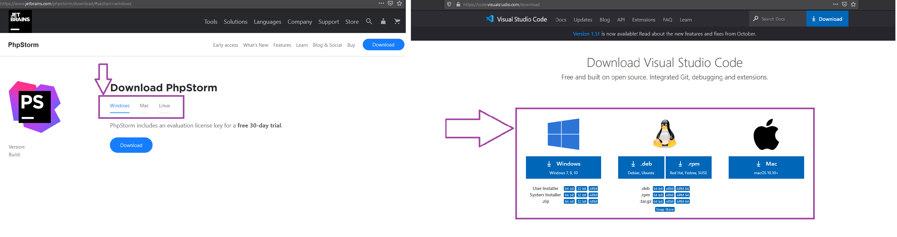

##### Step 3 
 
After the download is complete, run the installation file and follow the prompts carefully. The installation window will inform you once the installation is complete.

*PLEASE NOTE:* If you want to install the IDE tools via command line, the commands will be available on the download page. 

## Install PHP 

You need to have PHP7.1 or greater installed on the command line.Follow these instructions to install PHP on your system. 

##### Step 1  

Head to the PHP page and download the current stable version for your Operating System. 

Here's the link : [PHP](https://www.php.net/downloads.php)

    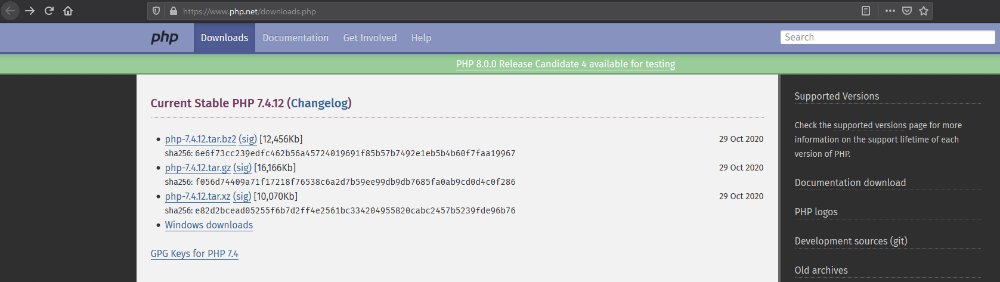

##### Step 2 

Unpack/Extract the zip file or content into a file named "php" on the main drive on your system. 

        eg. C:/php
        
##### Step 3 

Once the files have been extracted, you will need to go into the folder and edit the configuration settings file. 

Configure "php.ini" file: 
 
        Go to the folder where you extracted PHP. 
        Delete file named "php.ini". 
        Rename file named "php.ini-development" to "php.ini".
        Open php.ini file by opening it with Notepad or IDE tool 
        

    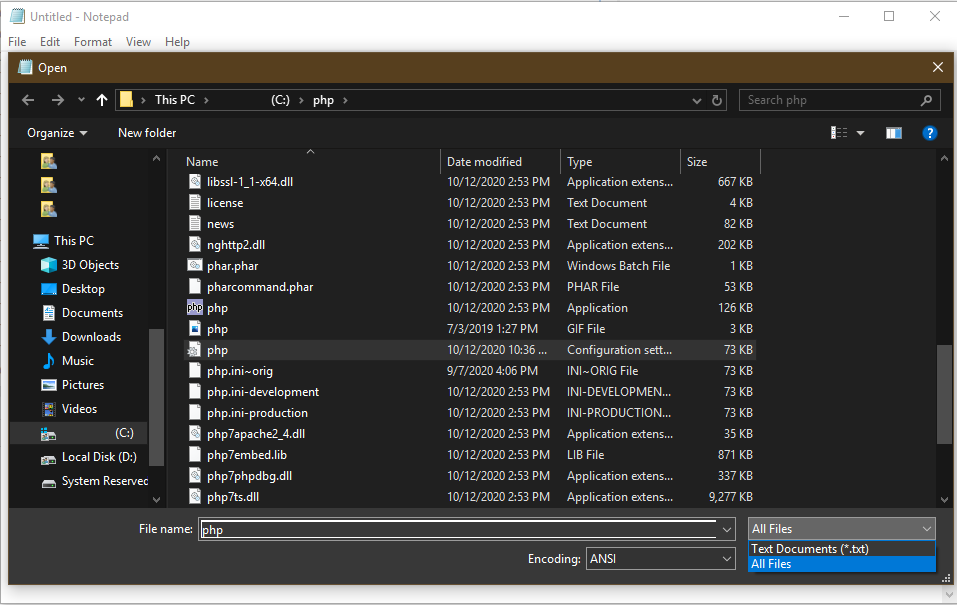

            Find ';extension_dir = "ext"' and remove the semicolon infront of the word extension
            Find ";extension=curl" and remove the semicolon infront of the word extension
            Find ";extension=fileinfo" and remove the semicolon infront of the word extension
            Find ";extension=gd2" and ...
            Find ";extension=intl" and ...
            Find ";extension=mbstring" and ...
            Find ";extension=openssl" and ...
            Find ";extension=pdo_mysql" and ...
            Find ";extension=shmop" and ...
            Find ";extension=soap" and ...
            Find ";extension=sqlite3" and ...
            Find ";extension=tidy" and ...
            Find ";extension=xmlrpc" and ...
            Find ";extension=xsl" and ...
        Press Ctrl+S or save changes you just made to "php.ini" file. 
        

    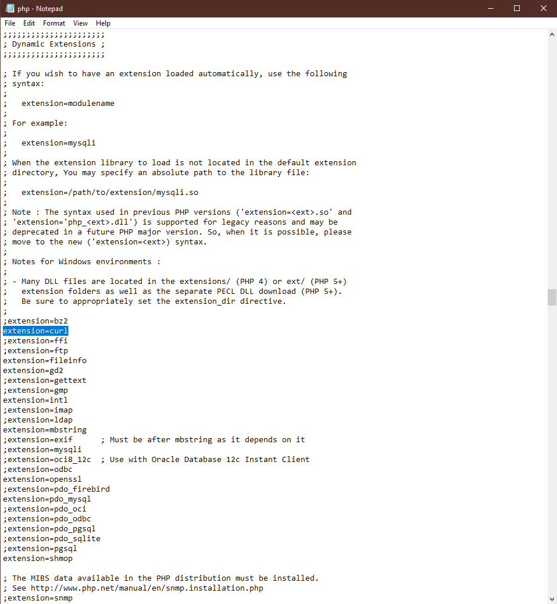

##### Step 4 

After you have made changes to the configuration file, you must add the PHP folder in your systems environment variable table.

Add path environment variable:
    
        Open Control Panel
        Go to System
        Go to Advanced system settings
        

    

        Go to Environment variable 
        Look for "Path" in the "Variable" column and click Edit.
       

    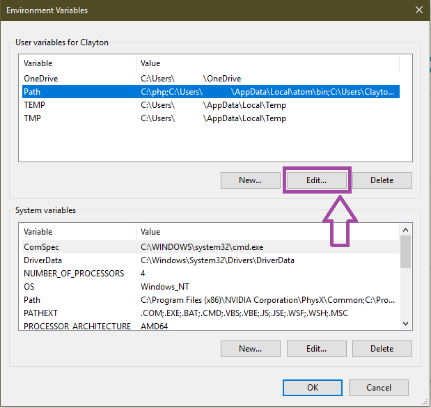

        
        Click on Browse, locate the PHP folder you uxtracted. 
        Click OK and then click Ok again to close the "Edit environment variable" window.
        

    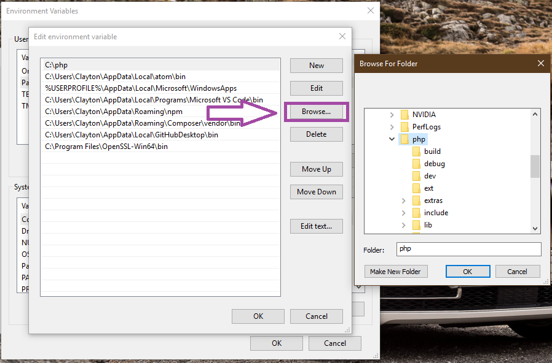

##### Step 5 
 
Complete the installation by restarting your system so that changes may take effect. After this you can confirm if the installation successful by opening your command terminal (e.g Command Prompt or terminal in your IDE tool) and typing in "php -v" and pushing Enter. The PHP version and details will appear in the terminal.    

    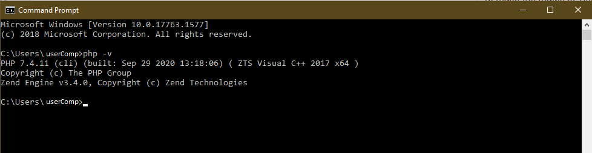

            
## Install Composer

Follow these instructions to install Composer on your system. 

#### For Windows

##### Step 1 
 
Head to the Composer page and download the current stable version for your Operating System.

Here's the link : [Composer](https://getcomposer.org/Composer-Setup.exe)

    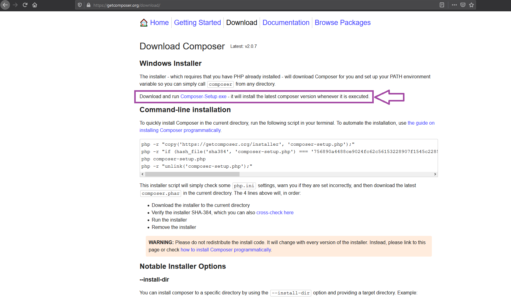

     
##### Step 2 
 
After the download is complete, run the installation file and follow the prompts carefully. The installation window will inform you once the installation is complete.

##### Step 3

Complete the installation by restarting your system so that changes may take effect.After this you can confirm if the installation was a success by opening your command terminal (e.g Command Prompt or terminal in your IDE tool) and typing in "composer -V" and pushing Enter. The Composer version and details will appear in the terminal.

    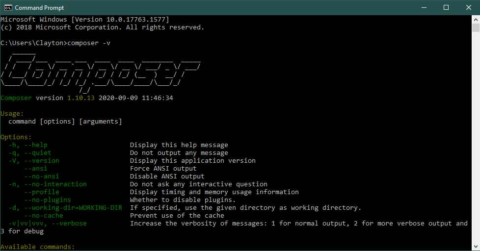

*PLEASE NOTE:* If you want to install Composer via command line, the commands will be available on the download page.

#### For Linux/Unix/macOS

##### Step 1 
 
Download the latest stable version by clicking this link: [Composer](https://getcomposer.org/installer)

##### Step 2 

There are two install options for Composer namely: Locally (as part of your project) and Globally (system wide executable). You can choose to install in Locally as it is needed to run Tina4, but you can install it globally to use Composer in other projects. 

Go to the [Composer installer](https://getcomposer.org/doc/00-intro.md#installation-linux-unix-macos) page to view instructions on how to install Composer for your OS.

    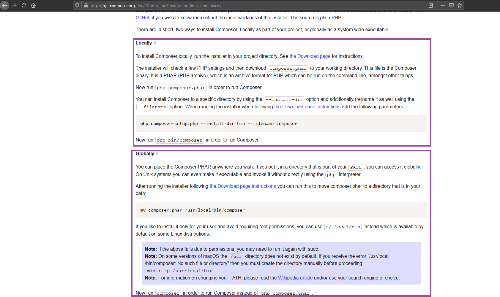

##### Step 3

Complete the installation by restarting your system so that changes may take effect.After this you can confirm if the installation was a success by opening your command terminal (e.g Command Prompt or terminal in your IDE tool) and typing in "composer -V" and pushing Enter. The Composer version and details will appear in the terminal.

## Install OpenSSL

Follow these instructions to install OpenSSL on your system. 

#### For Windows

##### Step 1 

Head to the Shining Light Productions page and download the current stable version for your Operating System. In this case we are using a x64bit Windows. 

Here's the link : [Shining Light Productions](https://slproweb.com/products/Win32OpenSSL.html) 

    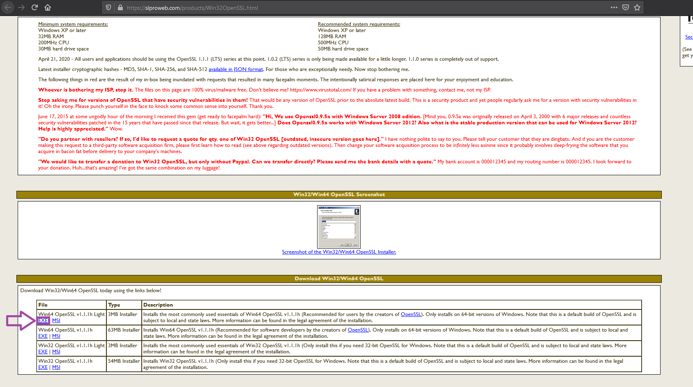

  
##### Step 2 

After the download is complete, run the installation file and follow the prompts carefully. The installation window will inform you once the installation is complete. 

##### Step 3 
 
After you have installed OpenSSL, you must add the OpenSSL bin folder in your systems environment variable table.

Add path environment variable:
    
        Open Control Panel
        Go to System
        Go to Advanced system settings
        

    

        

        Go to Environment variable 
        Look for "Path" in the "Variable" column and click Edit.
        

    

        Click on Browse, locate the "bin" folder directory where you installed OpenSSL (e.g. C:\Program Files\OpenSSL-Win64\bin). 
        Click OK and then click Ok again to close the "Edit environment variable" window.  

    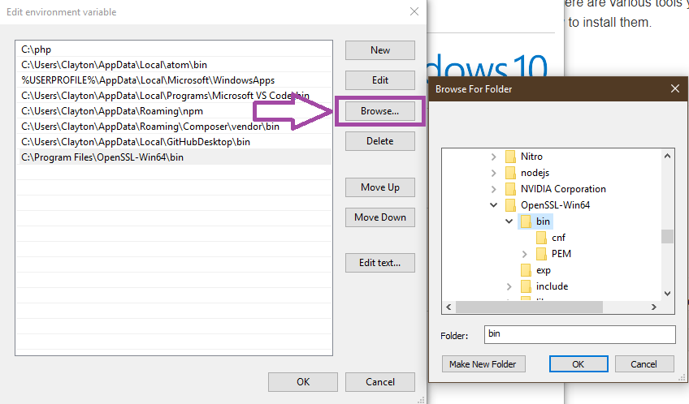

 

##### Step 4       

Complete the installation by restarting your system so that changes may take effect.After this you can confirm if the installation was a success by opening your command terminal (e.g Command Prompt or terminal in your IDE tool) and typing in "openssl version" and pushing Enter. This will display the OpenSSL version if installed correctly. If you receive an error, the installation was unsuccessful. In this case, uninstall OpenSSL and follow the steps again.

    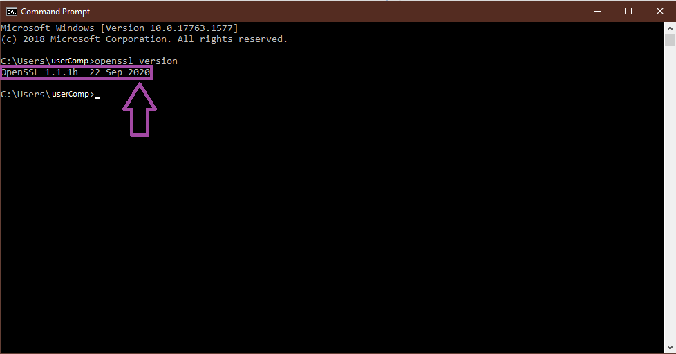

 
#### For Linux/Unix/macOS

##### Step 1 
 
Head to the OpenSSL website and download the Light v1.1.1 version.

Here's the link: [OpenSSL](https://www.openssl.org/source/)

    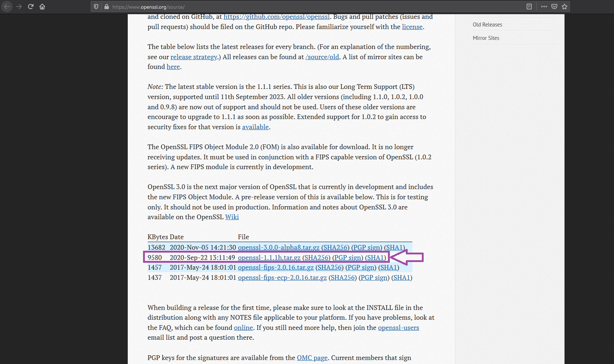

##### Step 2 
 
Run the installer and follow the instructions in the links below to complete the installation process:

For Mac:
Visit [franz.com](https://franz.com/support/openssl-mac.lhtml) || [stackoverflow.com](https://stackoverflow.com/questions/15185661/update-openssl-on-os-x-with-homebrew)

For Unix:
Visit [cloudwafer.com](https://cloudwafer.com/blog/installing-openssl-on-ubuntu-16-04-18-04/) || [howtoforge.com](https://www.howtoforge.com/tutorial/how-to-install-openssl-from-source-on-linux/)

 
## Install Tina4

Once the prerequisites have been installed you can create a project folder and proceed to run the Tina4 installation.

##### Step 1

First you will need a folder in which Tina4 will be installed. In this example the folder is named tina4-php. Make your project directory by running this command in your terminal:

      mkdir your_project_folder
      

    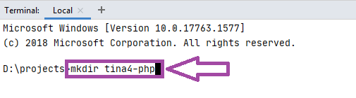

##### Step 2

Once your project folder has been created, you will need to direct the command line to go into the fodler you just created. In this example the folder is named "tina4-php". For more information on how to navigate directories with command line, please visit How To Geek by clicking this link: [How To Geek](https://www.howtogeek.com/659411/how-to-change-directories-in-command-prompt-on-windows-10/)Ensure your command terminal is pointed to the right directory by running this command in your terminal:
    
      cd your_project_folder
      

    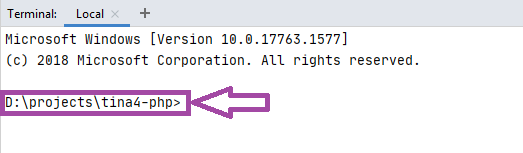

##### Step 3 

Once you've created the project folder and went into it via the command line, you will need to create an "index.php" file which has the Tina4 methods and functions in it. Run the following command in your command terminal to create the required "index.php" file and contents:

###### For Windows 

    echo ^<?php require_once "vendor/autoload.php"; echo new \Tina4\Tina4Php(); ^ > index.php

    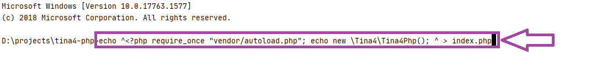

###### For Linux & Mac 

    echo '<?php require "vendor/autoload.php"; echo new \Tina4\Tina4Php();' > index.php
    

    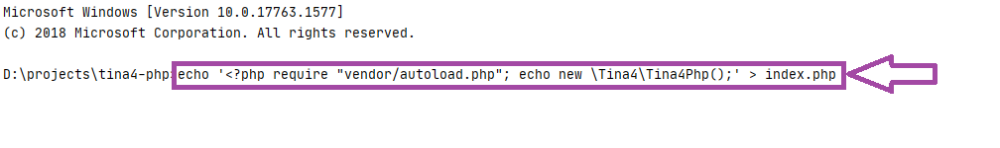

A PHP file will be created in the project folder you made and will look like this... 

    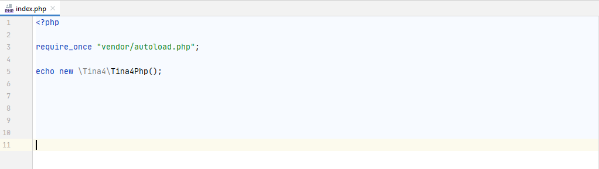

##### Step 4

Great, now that the "index.php" file has been created, we will install all the Tina4 libraries and dependencies in the project folder. Run "composer require andrevanzuydam/tina4php" in your IDE terminal or command line then Tina4 will start installing and create all the dependencies between your libraries and components. The terminal will inform you once the installation is complete. 

    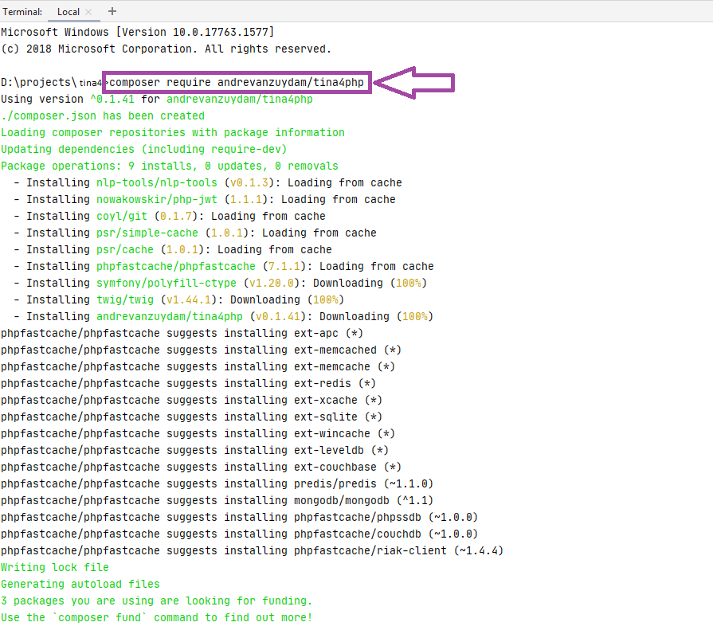

Your project folder will now look like this... 

    

##### Step 5

Almost there... Now you must create an ".env" file in your project folder. This file will be used to setup constants in your project needed for Tina4. Run "echo .>.env" in your IDE terminal or command line.

    echo .>.env
    

    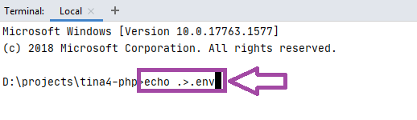

 

Your project folder will now look like this... 

    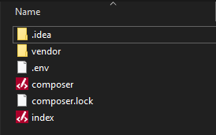

##### Step 6

Now that we created and installed everything we need to run Tina4, we can test to check if it was successful. Spin up a webserver by running "php -S localhost:7145 index.php" in your IDE terminal or command line. Once you ran the command, go to your browser and type "localhost:7145" in your URL address bar and hit enter (or click the address in the terminal). 
 
    php -S localhost:7145 index.php
    

    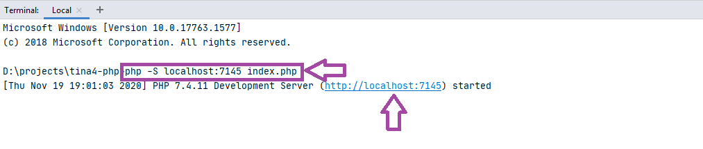

If the Tina4 404 error page loads, that means everything is working perfectly...

    

aaaaaaaaaand Voila! Tina4 is now installed and you have everything you need to start bringing your ideas to life.   

Continue to [recommendations](recommendations.md) or [how do I?](howdoi.md)

    

