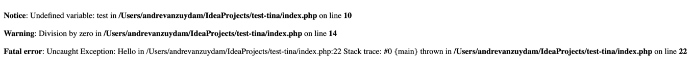
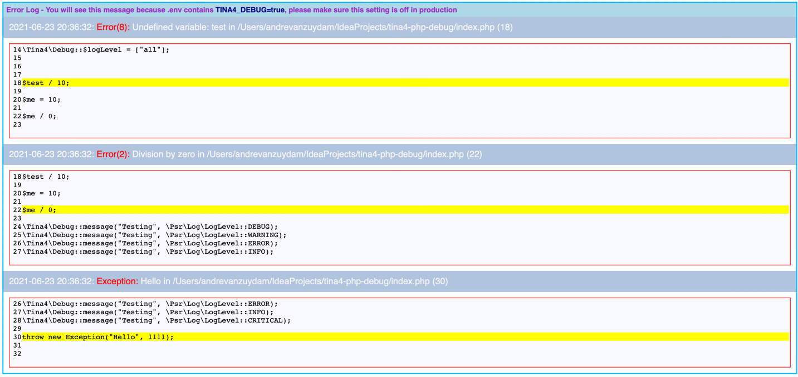

# Readme
## Tina4 Php Debug

A generic debugging module which can enhance your normal PHP project

### Install the module using composer

```
composer require tina4stack/tina4php-debug
```

### Some examples of what to expect

Normal error handling looks like this



Tina4 debug exception handling and errors will be published to the screen automatically for you.



You also get some nice console output


### Setting this up in your project

In your code you need to set some constants to get this working.
```php index.php
<?php
const TINA4_DOCUMENT_ROOT = __DIR__;
const TINA4_DEBUG = true;
require_once "vendor/autoload.php";

//Set the log level of what you want reported to console
//Can be an array of the values as listed below

\Tina4\Debug::$logLevel = [TINA4_LOG_DEBUG, TINA4_LOG_INFO];

//You can code here as per normal

//If you want to output console messages use code like this

\Tina4\Debug::message("Testing", TINA4_LOG_DEBUG);
\Tina4\Debug::message("Testing", TINA4_LOG_WARNING);
\Tina4\Debug::message("Testing", TINA4_LOG_ERROR);
\Tina4\Debug::message("Testing", TINA4_LOG_INFO);
\Tina4\Debug::message("Testing", TINA4_LOG_CRITICAL);

//Render the debug
echo \Tina4\DebugRender::render();

```

### Log Levels

```
const TINA4_LOG_EMERGENCY = "emergency";
const TINA4_LOG_ALERT = "alert";
const TINA4_LOG_CRITICAL = "critical";
const TINA4_LOG_ERROR = "error";
const TINA4_LOG_WARNING = "warning";
const TINA4_LOG_NOTICE = "notice";
const TINA4_LOG_INFO = "info";
const TINA4_LOG_DEBUG = "debug";
const TINA4_LOG_ALL = "all";
```
