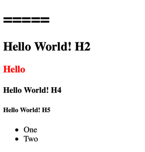

# tina4php-shape
HTML Language called Shape where you write code to make HTML

### Installation

```bash
composer require tina4stack/tina4php-shape
```

### Basic usage

Each HTML tag has an underscore prefix, `<p>` tag would be `_p()`

#### Normal Tag
```php
echo _p("Hello"); //<p>Hello</p>
```

#### Tag with Attributes
```php
echo _div(["class" => "form-group"], "Testing"); //<div class="form-group">Testing</div>
```

#### Nesting of tags

Some things become easier to code due to nesting, think of un ordered lists or select tags.

```php
$lis = [];

$lis[] = _li("One");
$lis[] = _li("Two");

$ul = _ul ($lis);

$options = [];

$options[] = _option("One");
$options[] = _option("Two");

$select = _select (["name" => "choose"], $options);

```

#### Finding a tag by id

Sometimes you want to manipulate a tag's content, so we find it based on the id attribute.

```php
$tag = $html->byId("someId");
```

#### Set the html of a tag

```php
$tag->html(_p("Changed HTML"));
```


### Example
```php
<?php
require_once "vendor/autoload.php";

//Start some HTML

$lis = [];

$lis[] = _li("One");
$lis[] = _li("Two");

$ul = _ul ($lis);

$html = _shape(
    _doctype("html"),
    _html(["lang" => "en"],
    _head(
        _title("Testing")
    ),
    _body(
        _h1(["id" => "someId"],"Hello World! H1"),
        _h2("Hello World! H2"),
        $a = _h3("Hello World! H3"),
        _h4("Hello World! H4"),
        _h5("Hello World! H5"),
        $ul
    )
));

$a->html(_b(["style" => "color: red"],"Hello"));

$html->byId("someId")->html("=====");

echo $html;

```

You should see something like this

